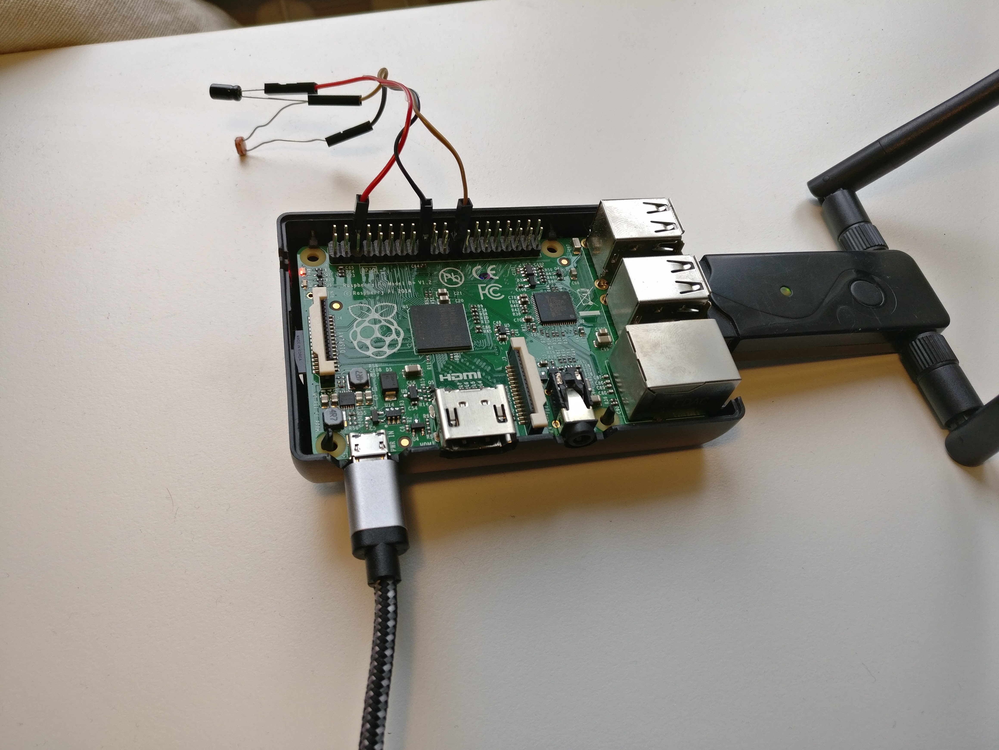

Client
======

Verwendete Hardware
-------------------
Lorem ipsum dolor sit amet, consetetur sadipscing elitr,

    Raspberry Pi mit Sensor

Sensoabfrage
------------
Lorem ipsum dolor sit amet, consetetur sadipscing elitr,

Probleme
--------

Das erste Problem stellt der Helligkeitsverlauf über einen Tag dar: umso rechtwinkliger die Sonne zum Standort, desto
intensiver wird das Licht. Daraus würden fehlerhafte Messdaten hervorgehen, denn z.B. eine Wolke die mittags die Sonne
verdeckt könnte äquivalent zu Sonnenschein nach dem Sonnenaufgang sein. Es muss also eine Justierung der Messdaten
stattfinden.