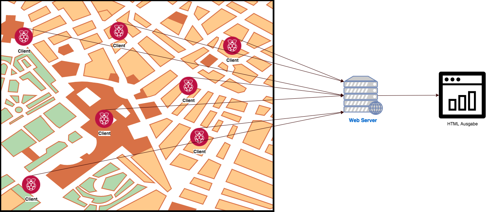
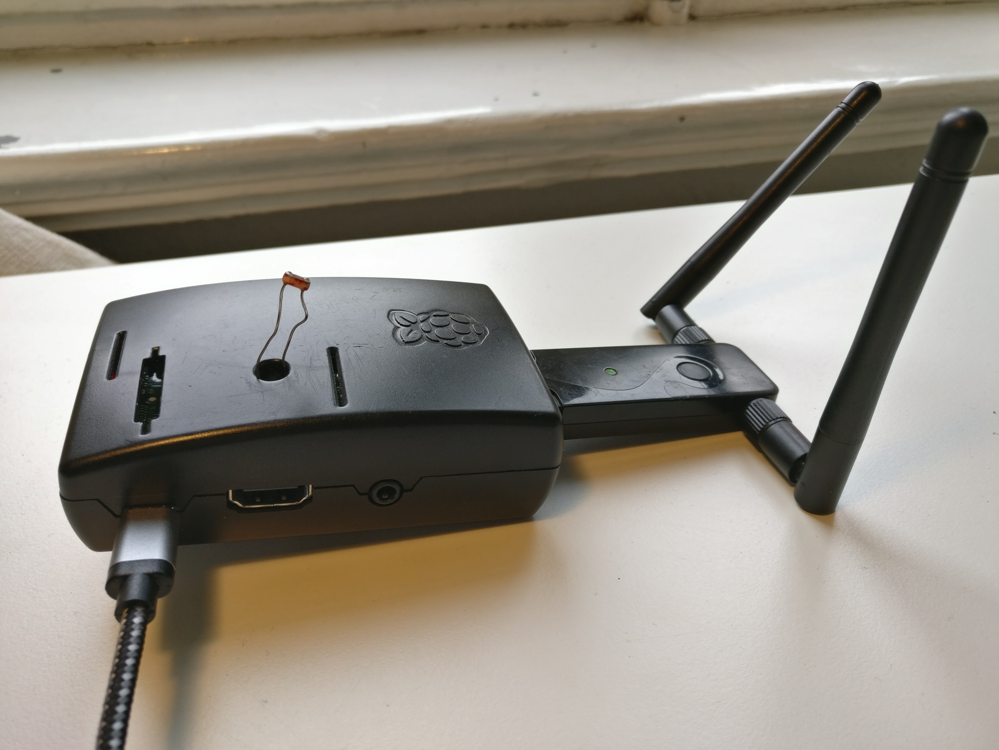
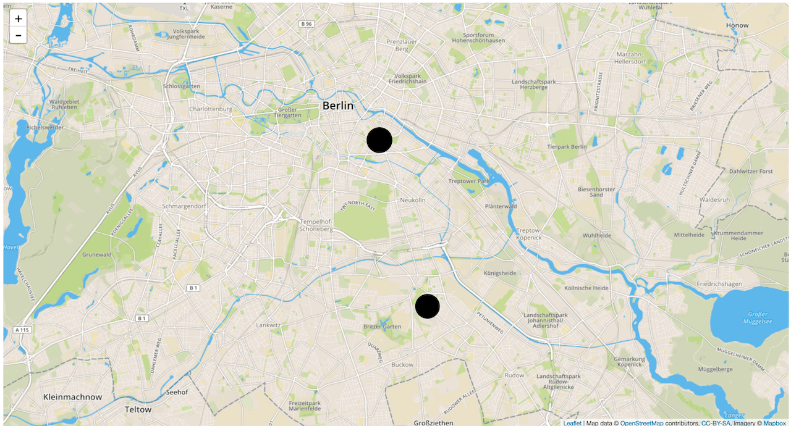

Einleitung
==========

Idee
----

Es sollen die exakten Sonnenstunden an mehreren Standorten erfasst werden. Dazu wird die Helligkeit mit dem Photowiderstand
gemessen und von einem Raspberry Pi verarbeitet. Als Ausgabe dessen wird sein: Sonne, Wolken mit verminderter
Wolkendichte, Wolken mit verstärkter Wolkendichte, Dunkel. Gleichzeitig wird die Dauer dieser Zustände gemessen und
in einer Datenbank gespeichert.

.. rubric:: References

.. [BiDB79] Biskup, J.; Dayal, U.; Bernstein, P.A..: Synthesizing independent database schemas. In: ACM SIGMOD 1979 Int. Conf. On Management of Data Proceedings, S. 143-151.

.. [BeBe79a] Beeri, C.; Bernstein, P.A.: Computational problems related to the design of normal relational schemas. ACM Trans. Database Syst., No. 1, 1979, S. 30-59.

.. [BeBe79b] Beeri, C.; Bernstein, P.A.: Computers are stupid. ACM Trans. Database Syst., No. 4, 1979, S. 253-266.

Über das Programm
-----------------
Das Programm dient zur Auswertung von den Helligkeitswerten von mehreren Standorten. Dazu wurde
eine Zentrale Webseite mit einer API Schnittstelle erstellt auf welche mehrere Raspberry Pi's zugreifen.

Die Website wertet mit jeden neuen daten upload die daten aus und gib diese Grafisch wieder.

Das Projekt besteht aus 3 bestandteilen.

    Software Design

.. index:: Software Design

Raspberry Pi Client
^^^^^^^^^^^^^^^^^^^

Der Client wurde in Python 2.7 für den Raspberry Pi geschrieben.

- Quellcode : https://github.com/BrightnessMonitor/BrightnessMonitorClient

.. index:: Git
.. index:: Quellcode

    Raspberry Pi Brightness Monitor Client mit WLAN

Website
^^^^^^^

Der Server wurde in das Python Web Framework "Django" geschrieben und auf einer gratis Instanz von `heroku.com`_ gehostet.

.. _heroku.com: https://heroku.com/

- Quellcode : https://github.com/BrightnessMonitor/BrightnessMonitorWeb
- Website URL: https://infinite-crag-79176.herokuapp.com/

.. index:: Git
.. index:: Django
.. index:: Heroku.com

    Bild Quelle: https://en.wikipedia.org/wiki/Heroku

    Screenshot von https://infinite-crag-79176.herokuapp.com/

Dokumentation
^^^^^^^^^^^^^

- Quellcode : https://github.com/BrightnessMonitor/BrightnessMonitor.github.io
- Online Dokumentation: https://brightnessmonitor.github.io/

.. index:: Git
.. index:: Quellcode
.. index:: Online Dokumentation