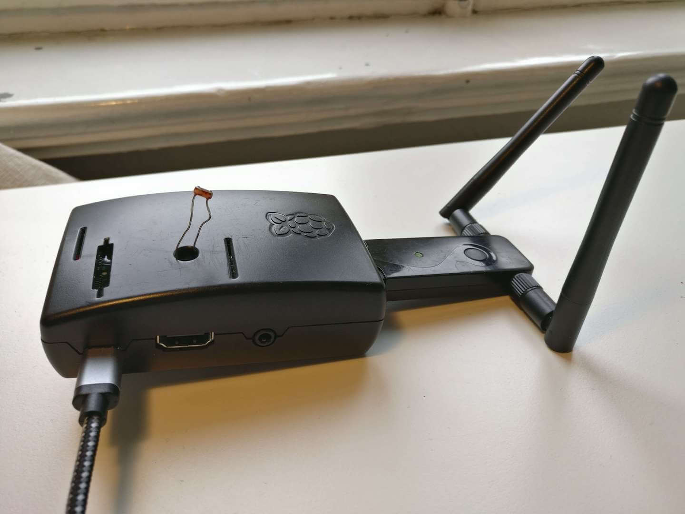

Idee
----

Es sollen die exakten Sonnenstunden an einem Standort erfasst werden. Dazu wird die Helligkeit mit dem Photowiderstand
gemessen und von einem Raspberry Pi verarbeitet. Als Ausgabe dessen wird sein: Sonne, Wolken mit verminderter
Wolkendichte, Wolken mit verstärkter Wolkendichte, Dunkel. Gleichzeitig wird die Dauer dieser Zustände gemessen und
in einer Datenbank gespeichert.

Probleme vorab
--------------

Das erste Problem stellt der Helligkeitsverlauf über einen Tag dar: umso rechtwinkliger die Sonne zum Standort, desto
intensiver wird das Licht. Daraus würden fehlerhafte Messdaten hervorgehen, denn z.B. eine Wolke die mittags die Sonne
verdeckt könnte äquivalent zu Sonnenschein nach dem Sonnenaufgang sein. Es muss also eine Justierung der Messdaten
stattfinden.

Über das Programm
-----------------
Das Programm dient zur Auswertung von den Helligkeitswerten von mehreren Standorten. Dazu wurde
eine Zentrale Webseite mit einer API Schnittstelle erstellt auf welche mehrere Raspberry Pi's zugreifen.

Die Website wertet mit jeden neuen daten upload die daten aus und gib diese Grafisch wieder.

Das Projekt besteht aus 3 bestandteilen.

Raspberry Pi Client
^^^^^^^^^^^^^^^^^^^

Der Client wurde in Python 2.7 für den Raspberry Pi geschrieben.

- Quellcode : https://github.com/BrightnessMonitor/BrightnessMonitorClient

.. index:: Git
.. index:: Quellcode

    Raspberry Pi Brightness Monitor Client mit WLAN

Website
^^^^^^^

Der Server wurde in das Python Web Framework "Django" geschrieben und auf einer gratis Instanz von `heroku.com`_ gehostet.

.. _heroku.com: https://heroku.com/

- Quellcode : https://github.com/BrightnessMonitor/BrightnessMonitorWeb
- Website URL: https://infinite-crag-79176.herokuapp.com/

.. index:: Git
.. index:: Django
.. index:: Heroku.com

.. figure:: _static/img/Heroku_logo.png
    :alt: Heroku.com logo

    Bild Quelle: https://en.wikipedia.org/wiki/Heroku

    Screenshot von https://infinite-crag-79176.herokuapp.com/

Dokumentation
^^^^^^^^^^^^^

- Quellcode : https://github.com/BrightnessMonitor/BrightnessMonitor.github.io
- Online Dokumentation: https://brightnessmonitor.github.io/

.. index:: Git
.. index:: Quellcode
.. index:: Online Dokumentation